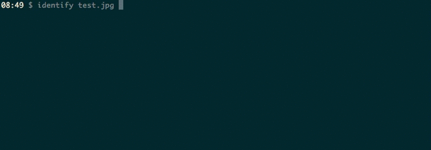

# Retinator

Retinator resizes the source image and generates three images in @1x, @2x and @3x iOS resolutions.



## Usage

```        
retinator [source_image] [destination_resolution]
retinator --help

Parameters:
  - [source_image]: path to the source image"
  - [destination_resolution]: a number indicating the minimum resolution"
    of the smaller dimension of the destination @1x image"

Example:"
  For an input image of 3000x1500, 'retinator test.jpg 200' will output:"
    test.png    (400x200)"
    test@2x.png (800x400)"
    test@3x.png (1200x600)"
```

## Installation

This gem needs ImageMagick or GraphicksMagick in order to run. It has to be installed using a [brew](https://brew.sh) formula. Run this command in your terminal:

```
brew install graphicsmagick
```

After that you can install the tool the usual way:

```
bundle install
gem build retinator.gemspec
gem install retinator-[VERSION].gem
```